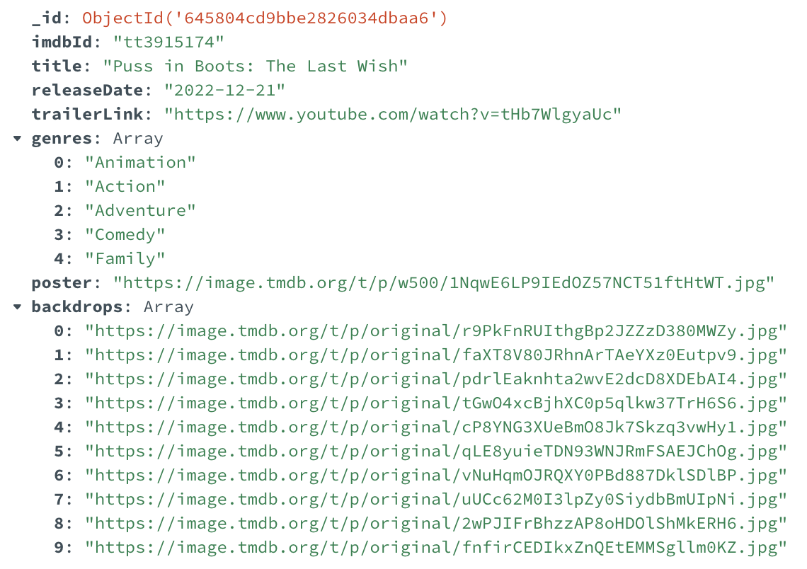
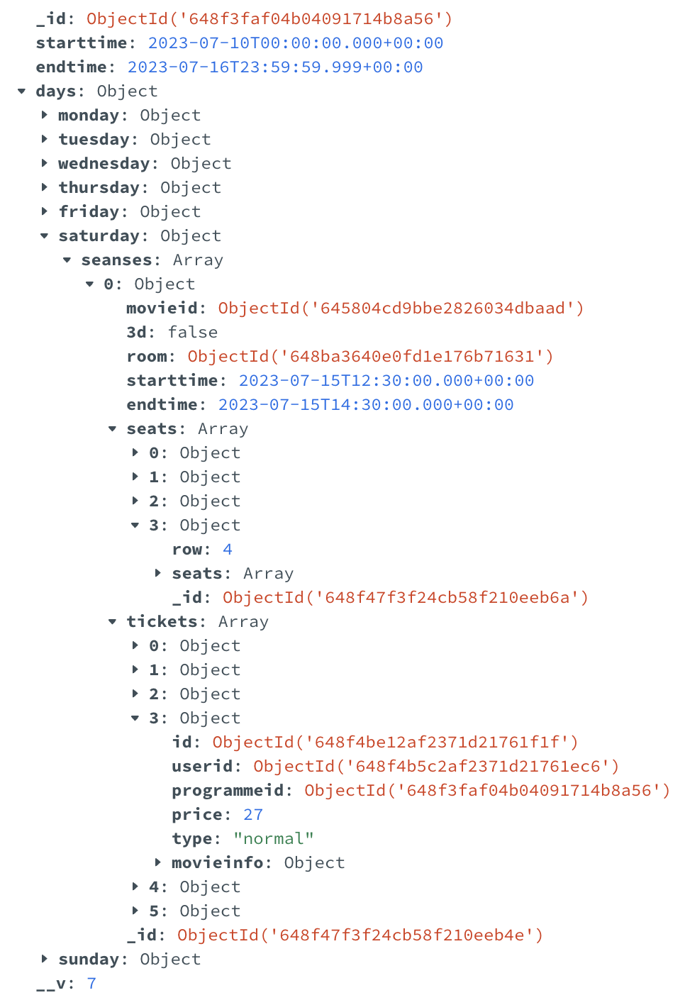
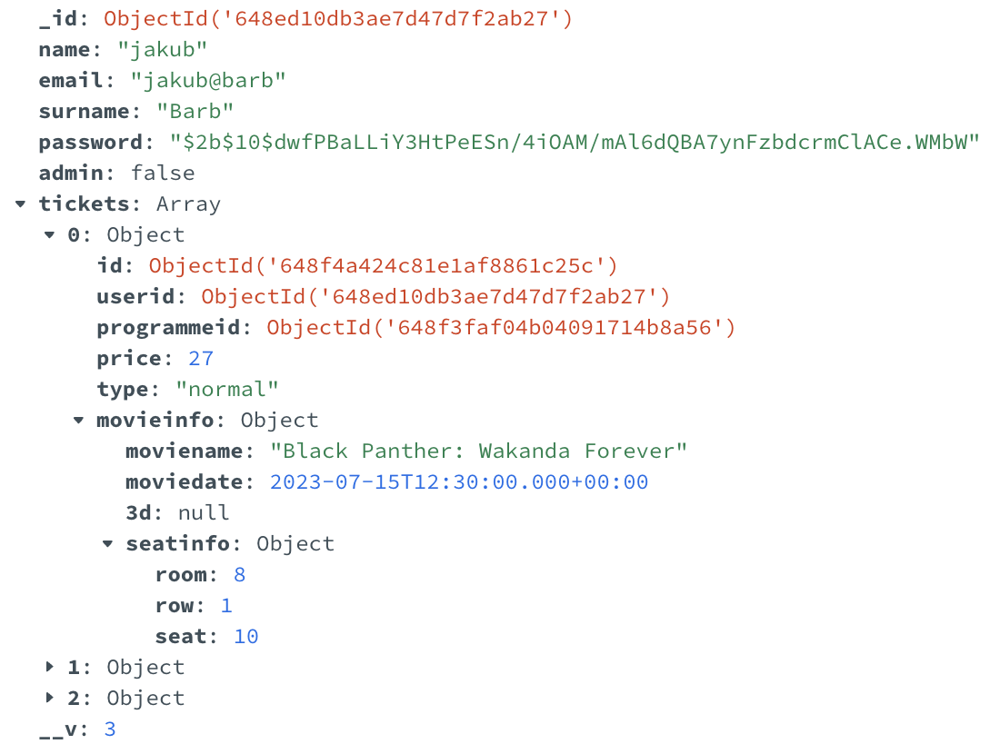
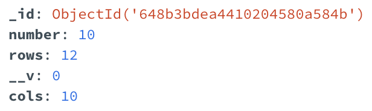
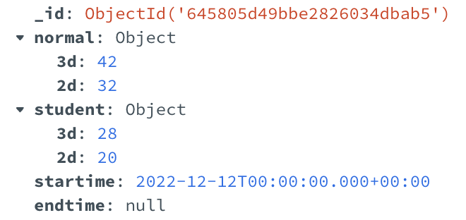

## **Skład grupy:** Filip Dziurdzia, Zofia Lenart, Jakub Barber
### **Technologia:** MongoDB, Node.js, React
### **Temat:** Lokalne Kino

**Zofia Lenart**: zlenart@student.agh.edu.pl

**Jakub Barber:** jakubbarber@student.agh.edu.pl

**Filip Dziurdzia:** fdziurdzia@student.agh.edu.pl

# Baza Danych
Baza danych składa się z 5 kolekcji: Movies, Programme, Users, Rooms oraz Prices.

## Movies

Kolekcja **Movies** zawiera podstawowe informacje o filmach puszczanych w naszym kinie. Wszystkie dane zostały pobrane za pomocą IMDB API. Przykładowy dokument w kolekcji Movies.



## Programme

Kolekcja **Programme** jest najbardziej rozbudowaną strukturą w naszej bazie. Każdy dokument reprezentuję repertuar na dany tydzień. Zawiera on początek i koniec danego tygodnia oraz obiekt **days** składający się z 7 dni tygodnia. Każdy dzień tygodnia zawiera tablicę **seansów**. Każdy **seans** zawiera podstawowe dane, takie jak **movieid** wskazujący na puszczany wtedy film, początek i koniec seansu oraz macierzy miejsc sygnalizujacych zajęcie miejsca i tablicy kupionych biletów.

<!-- ss do poprawy -->


## Users

Kolekcja **Users** zawiera informację o użytkownikach, którzy stworzyli konto podczas zakupu biletu. Każdy dokument zawiera podstawowe informacje o użytkowniku takie jak: imię, nazwisko, e-mail, zakodowane hasło, rola oraz tablica biletów. **Bilet** trzymany w userze jest identyczny co ten trzymany w seansie. Składa się on z kluczy obcych do usera oraz seansu, ceny, typu, miejsca oraz zawiera podstawowe informacje o filmie na który został on zakupiony.



## Rooms

Kolekcja **Rooms** zawiera informacje o salach dostępnych w naszym kinie. Każda sala jest osobnym dokumentem zawierającym numer sali, liczbę rzędów oraz liczbę miejsc w rzędzie.




## Prices

W kolekcji **Prices** trzymamy ceny biletów normalnych i ulgowych, zarówno dla filmów 2D jak i 3D. Dodatkowo mamy informacje od kiedy obowiązują dane ceny oraz do kiedy były używane. Ceny aktualne posiadają **null** w polu **endtime**




# Backend

Po stronie backendu zrealizowaliśmy podstawowe funkcje potrzebne do obsługi aplikacji kina. Poniżej zamieściliśmy przykładowe funkcjonalności które zrealizowaliśmy.

## Widoki

Widok biletów użytkownika
```javascript
const getUserTickets = async (req, res) => { //userid
  const ObjectId = mongoose.Types.ObjectId;
  try {
    const user = await User.findById(new ObjectId(req.body.userid));
    if (!user) {
      throw new Error("User of given Id does not exist")
    }
    // console.log(user.tickets);
    res.status(200).json({ tickets: user.tickets });
  } catch (err) {
    res.status(400).json({ message: err.message });
  }
}
```

Widok repertuaru na **x** zadanych tygodni
```javascript
const getProgrammeForXWeeksAheadPopulated = async (req, res) => { //przesłać current date and current date + 7days
  const date = new Date()
  try {
    const programmes = await Programme.find({
      endtime: { $gte: date }
    }).sort({ endtime: 1 })
      .limit(x)
    if (programmes.length === 0) {
      throw new Error("Programme doesn't exist")
    }
    await Programme.populatePogrammeArray(programmes)
    res.status(200).json({ programmes: programmes });
  }
  catch (err) {
    res.status(400).json({ message: err.message })
  }
}
```

## Procedury

Procedura dodania nowego seansu

```javascript
const addSeanse = async (req, res) => { //date, room (id), starttime, endtime, is3d, movieid 
  try {
    const ObjectId = mongoose.Types.ObjectId;
    const date = new Date(req.body.date);
    const programme = await Programme.findOne({ 
      starttime: { $lte: date },
      endtime: { $gte: date }
    });
    if (!programme) {
      throw new Error("Programme doesn't exist"); 
    }
    const day = getDayName(date.getUTCDay());
    const foundRoom = await Room.findById(new ObjectId(req.body.room));
    console.log(`FoundRoom: ${foundRoom}`)
    if (!foundRoom) {
      throw new Error("This room doesn't exist");
    }
    const starttime = new Date(req.body.starttime); 
    const endtime = new Date(req.body.endtime);

    const dailySeanses = programme.days[day].seanses
    const existsRoomCollision = dailySeanses.find(seanse => req.body.room === seanse.room.toString() && checkPotentialOverlap(starttime, endtime, new Date(seanse.starttime), new Date(seanse.endtime)))

    if (existsRoomCollision) {
      throw new Error("Provided Room is occupied at the same time")
    }

    // checking if movie exists
    const movie = await Movie.findById(new ObjectId(req.body.movieid));

    if (!movie) {
      throw new Error("Movie doesn't exist");
    }

    const seats = createEmptyRoom(foundRoom.rows, foundRoom.cols)
    const seanse = {
      movieid: new ObjectId(req.body.movieid),
      "3d": req.body.is3d,
      room: new ObjectId(req.body.room),
      starttime: starttime,
      endtime: endtime,
      seats: seats,
      tickets: []
    };
    programme.days[day].seanses.push(seanse);
    const updatedProgramme = await programme.save();
    res.json({ programme: updatedProgramme, seanse: seanse });
  } catch (err) {
    res.json({ message: err.message })
  }
};
```

Rejestracja nowego użytkownika
```javascript
const registerUser = async (req, res) => { //email na razie (ew. hasło etc.)
  try {
    const user = await User.find({ email: req.body.email })
    if (user.length !== 0) {
      throw new Error("User with given email already exists")
    }
    if (!req.body.password || !req.body.name || !req.body.surname) {
      throw new Error("Not full data about new client has been provided")
    }
    const hashedPassword = await generateHash(req.body.password)
    const data = new User({ ...req.body, password: hashedPassword, tickets: [] })

    const datatoSave = await data.save()
    res.status(200).json({ user: { id: datatoSave._id, email: datatoSave.email, name: datatoSave.name, surname: datatoSave.surname } })
  } catch (err) {
    res.status(400).json({ message: err.message })
  }
}
```

TODO - triggery